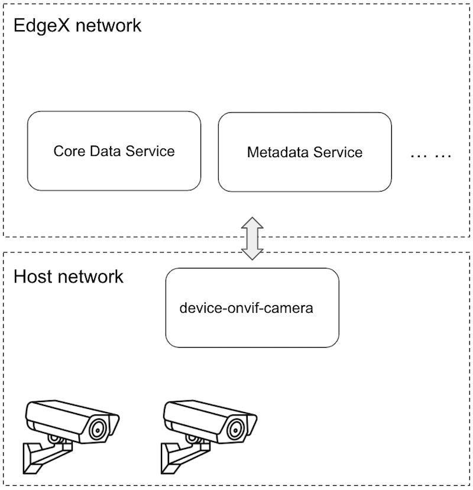

# Set Up Auto Discovery with Docker

The auto-discovery mechanisms uses multicast and unicast UDP to find  available cameras, so the device-onvif-camera service needs to send out the probe message to search.

However, we can’t send the multicast message from the **edgex network** to the **host network** in the **docker container**. 

The workaround is running the **dockerized device-onvif-camera** on the **host network**.



Note: For macOS, the network_mode: "host" probably does not as expected: https://github.com/docker/for-mac/issues/1031

## Non-Security Mode

### Prepare edgex-compose/compose-builder

#### 1. Download the [edgex-compose](https://github.com/edgexfoundry/edgex-compose) and setup it according to the [docker-compose setup guide](./docker-compose/README.md)

#### 2. Update  the `add-device-onvif-camera.yml` file with the following content:

1. Remove the `ports` configuration
2. Replace `networks` with `network_mode: "host"`
3. Remove `env_file`
4. Modify `SERVICE_HOST` env to match the machine IP
5. Set `EDGEX_SECURITY_SECRET_STORE` env to `"false"` value
6. Enable auto-discovery by `DEVICE_DISCOVERY_ENABLED` with `"true"` value
7. Use `DRIVER_DISCOVERYETHERNETINTERFACE` to specify the ethernet interface for discovering
8. Use `DRIVER_DEFAULTSECRETPATH` to specify the default secret path
9. Use `WRITABLE_LOGLEVEL` to specify the log level for debugging
10. Add `command` to override the CMD because we don't use the configuration provider from Consul

```yaml
services:
  device-onvif-camera:
    image: edgexfoundry/device-onvif-camera${ARCH}:${DEVICE_ONVIFCAM_VERSION}
    user: "${EDGEX_USER}:${EDGEX_GROUP}"
    container_name: edgex-device-onvif-camera
    hostname: edgex-device-onvif-camera
    read_only: true
    restart: always
    environment:
      SERVICE_HOST: 192.168.0.0
      EDGEX_SECURITY_SECRET_STORE: "false"
      DEVICE_DISCOVERY_ENABLED: "true"
      DRIVER_DISCOVERYETHERNETINTERFACE: enp0s3
      DRIVER_DEFAULTSECRETPATH: credentials001
      WRITABLE_LOGLEVEL: DEBUG
    depends_on:
      - consul
      - data
      - metadata
    security_opt:
      - no-new-privileges:true
    command: -cp=consul.http://localhost:8500 --registry --confdir=/res
```
> Example add-device-onvif-camera.yml contents

### Deploy EdgeX services and device-onvif-camera
Deploy services with the following command:
```shell
make run no-secty ds-onvif-camera
```

### Inspect the device-onvif-camera
The user can use docker logs to trace the auto-discovery
```shell
$ docker logs edgex-device-onvif-camera -f --tail 10
...
level=DEBUG ts=2021-12-17T08:26:38.686619358Z app=device-onvif-camera source=discovery.go:35 msg="protocol discovery triggered"
Onvif WS-Discovery: Find 192.168.56.101:10000 
Onvif WS-Discovery: Find 192.168.56.101:10001 
level=DEBUG ts=2021-12-17T08:26:39.726266165Z app=device-onvif-camera source=onvifclient.go:225 msg="SOAP Request: <tds:GetDeviceInformation></tds:GetDeviceInformation>"
level=DEBUG ts=2021-12-17T08:26:39.748227111Z app=device-onvif-camera source=onvifclient.go:243 msg="SOAP Response: <GetDeviceInformationResponse><Manufacturer>Happytimesoft</Manufacturer><Model>IPCamera</Model><FirmwareVersion>2.4</FirmwareVersion><SerialNumber>123456</SerialNumber><HardwareId>1.0</HardwareId></GetDeviceInformationResponse>"
level=DEBUG ts=2021-12-17T08:26:39.748270564Z app=device-onvif-camera source=driver.go:333 msg="Discovered camera from the address '192.168.56.101:10000'"
level=DEBUG ts=2021-12-17T08:26:39.761718293Z app=device-onvif-camera source=onvifclient.go:225 msg="SOAP Request: <tds:GetDeviceInformation></tds:GetDeviceInformation>"
level=DEBUG ts=2021-12-17T08:26:39.782834447Z app=device-onvif-camera source=onvifclient.go:243 msg="SOAP Response: <GetDeviceInformationResponse><Manufacturer>Happytimesoft</Manufacturer><Model>IPCamera</Model><FirmwareVersion>2.4</FirmwareVersion><SerialNumber>123456</SerialNumber><HardwareId>1.0</HardwareId></GetDeviceInformationResponse>"
level=DEBUG ts=2021-12-17T08:26:39.782871465Z app=device-onvif-camera source=driver.go:333 msg="Discovered camera from the address '192.168.56.101:10001'"
level=DEBUG ts=2021-12-17T08:26:39.782886193Z app=device-onvif-camera source=async.go:127 msg="Filtered device addition finished"
```
Then user can follow [this doc to add a provision watcher](./auto-discovery.md) to add the discovered devices to EdgeX.


## Security Mode

### Prepare edgex-compose/compose-builder

#### 1. Download the [edgex-compose](https://github.com/edgexfoundry/edgex-compose) and setup it according to the [docker-compose setup guide](./docker-compose/README.md)

#### 2. Replace the `add-device-onvif-camera.yml` with the following content:
```yaml
services:
  device-onvif-camera:
    image: edgex/device-onvif-camera${ARCH}:${DEVICE_ONVIFCAM_VERSION}
    user: "${EDGEX_USER}:${EDGEX_GROUP}"
    container_name: edgex-device-onvif-camera
    hostname: edgex-device-onvif-camera
    read_only: true
    restart: always
    environment:
      SERVICE_HOST: edgex-device-onvif-camera
      EDGEX_SECURITY_SECRET_STORE: "true"
      DEVICE_DISCOVERY_ENABLED: "true"
      DRIVER_DISCOVERYETHERNETINTERFACE: enp0s3
      DRIVER_DEFAULTSECRETPATH: credentials001
      
      SECRETSTORE_HOST: localhost
      STAGEGATE_BOOTSTRAPPER_HOST: localhost
      STAGEGATE_READY_TORUNPORT: 54329
      STAGEGATE_WAITFOR_TIMEOUT: 60s

      WRITABLE_LOGLEVEL: DEBUG
    depends_on:
      - consul
      - data
      - metadata
    security_opt:
      - no-new-privileges:true
    command: /device-onvif-camera -cp=consul.http://localhost:8500 --registry --confdir=/res
```

**Note**: The user should replace the host IP to match their own machine IP
1. Remove the `ports` configuration
1. Replace `networks` with `network_mode: "host"`
1. Remove `env_file`
1. Modify `SERVICE_HOST` env to match the machine IP
1. Set `EDGEX_SECURITY_SECRET_STORE` env to `"true"` value
1. Enable auto-discovery by `DEVICE_DISCOVERY_ENABLED` with `"true"` value
1. Use `DRIVER_DISCOVERYETHERNETINTERFACE` to specify the ethernet interface for discovering
1. Use `DRIVER_DEFAULTSECRETPATH` to specify the default secret path
1. Use `SECRETSTORE_HOST` to specify the Vault's host
1. Use `STAGEGATE_BOOTSTRAPPER_HOST`, `STAGEGATE_READY_TORUNPORT`, `STAGEGATE_WAITFOR_TIMEOUT` to specify the bootstrapper settings for waiting the security set up
1. Use `WRITABLE_LOGLEVEL` to specify the log level for debugging
1. Add `command` to override the CMD because we don't use the configuration provider from Consul    

#### 3. Export the Security Bootstrapper
Open the `add-security.yml` file and modify the `security-bootstrapper` section to export the port. This port is used for the device-onvif-camera to wait for the security setup.
```yaml
services:
  security-bootstrapper:
    ...
    ports:
      - "54329:54329"
```

### Deploy EdgeX services and device-onvif-camera
Deploy services with the following command:
```shell
make run device-onvif-camera
```

### Add Secrets to Secret Store (Vault)

```shell
curl --request POST 'http://192.168.56.101:59984/api/v2/secret' \
--header 'Content-Type: application/json' \
--data-raw '{
    "apiVersion":"v2",
    "path": "credentials001",
    "secretData":[
        {
            "key":"username",
            "value":"administrator"
        },
        {
            "key":"password",
            "value":"Password1!"
        }
    ]
}'
```

**Note**: The user should replace the host IP to match their own machine IP

### Inspect the device-onvif-camera
The user can docker logs to trace the auto-discovery
```shell
$ docker logs edgex-device-onvif-camera -f --tail 10
...
level=DEBUG ts=2021-12-17T08:26:38.686619358Z app=device-onvif-camera source=discovery.go:35 msg="protocol discovery triggered"
Onvif WS-Discovery: Find 192.168.56.101:10000 
Onvif WS-Discovery: Find 192.168.56.101:10001 
level=DEBUG ts=2021-12-17T08:26:39.726266165Z app=device-onvif-camera source=onvifclient.go:225 msg="SOAP Request: <tds:GetDeviceInformation></tds:GetDeviceInformation>"
level=DEBUG ts=2021-12-17T08:26:39.748227111Z app=device-onvif-camera source=onvifclient.go:243 msg="SOAP Response: <GetDeviceInformationResponse><Manufacturer>Happytimesoft</Manufacturer><Model>IPCamera</Model><FirmwareVersion>2.4</FirmwareVersion><SerialNumber>123456</SerialNumber><HardwareId>1.0</HardwareId></GetDeviceInformationResponse>"
level=DEBUG ts=2021-12-17T08:26:39.748270564Z app=device-onvif-camera source=driver.go:333 msg="Discovered camera from the address '192.168.56.101:10000'"
level=DEBUG ts=2021-12-17T08:26:39.761718293Z app=device-onvif-camera source=onvifclient.go:225 msg="SOAP Request: <tds:GetDeviceInformation></tds:GetDeviceInformation>"
level=DEBUG ts=2021-12-17T08:26:39.782834447Z app=device-onvif-camera source=onvifclient.go:243 msg="SOAP Response: <GetDeviceInformationResponse><Manufacturer>Happytimesoft</Manufacturer><Model>IPCamera</Model><FirmwareVersion>2.4</FirmwareVersion><SerialNumber>123456</SerialNumber><HardwareId>1.0</HardwareId></GetDeviceInformationResponse>"
level=DEBUG ts=2021-12-17T08:26:39.782871465Z app=device-onvif-camera source=driver.go:333 msg="Discovered camera from the address '192.168.56.101:10001'"
level=DEBUG ts=2021-12-17T08:26:39.782886193Z app=device-onvif-camera source=async.go:127 msg="Filtered device addition finished"
```
Then user can follow [this doc to add a provision watcher](./auto-discovery.md) to add the discovered devices to EdgeX.
