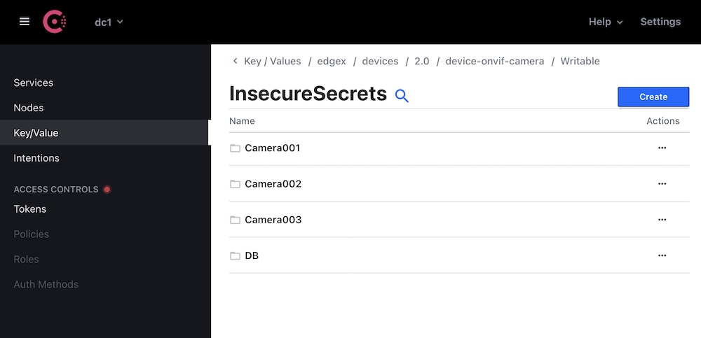

# Getting Started With Docker

This section describes how to run device-onvif-camera with docker.

## 1. Build docker image
Build docker image named edgex/device-onvif-camera:0.0.0-dev with the following command:
```shell
make docker
```

## 2. Prepare edgex-compose/compose-builder
Download the [edgex-compose](https://github.com/edgexfoundry/edgex-compose) and setup it according to the [docker-compose setup guide](./docker-compose/README.md)

## 3. Deploy EdgeX services and device-onvif-camera
 1. Change directory to the `edgex-compose/compose-builder`
 2. Deploy services with the following command:
```shell
make run no-secty device-onvif-camera
```

Check whether the device service is added to EdgeX
```shell
$ curl http://localhost:59881/api/v2/deviceservice/name/device-onvif-camera | json_pp
{
   "apiVersion" : "v2",
   "service" : {
      "adminState" : "UNLOCKED",
      "baseAddress" : "http://edgex-device-onvif-camera:59984",
      "created" : 1639381535081,
      "id" : "37f6fb6f-62c9-4290-99e1-a105764ca296",
      "modified" : 1639399810472,
      "name" : "device-onvif-camera"
   },
   "statusCode" : 200
}
```

Check whether the services are running from Consul


## 4. Manage the Username and Password for the Onvif Camera
The user can add or modify the username and password from the Consul.



The configuration.toml file defined the default username and password as below:
```yaml
[Writable]
LogLevel = "INFO"
  # Example InsecureSecrets configuration that simulates SecretStore for when EDGEX_SECURITY_SECRET_STORE=false
  # InsecureSecrets are required for when Redis is used for message bus
  [Writable.InsecureSecrets]
    [Writable.InsecureSecrets.DB]
    path = "redisdb"
      [Writable.InsecureSecrets.DB.Secrets]
    [Writable.InsecureSecrets.Camera001]
    path = "credentials001"
      [Writable.InsecureSecrets.Camera001.Secrets]
      username = "administrator"
      password = "Password1!"
    # If having more than one camera, uncomment the following config settings
    [Writable.InsecureSecrets.Camera002]
    path = "credentials002"
      [Writable.InsecureSecrets.Camera002.Secrets]
      username = "administrator"
      password = "Password1!"
```
https://github.com/edgexfoundry/device-onvif-camera/blob/main/cmd/res/configuration.toml

## 5. Add the device profile to EdgeX
Add the device profile to core-metadata service with the following command:
```shell
curl http://localhost:59881/api/v2/deviceprofile/uploadfile \
  -F "file=@./cmd/res/profiles/camera.yaml"
```

## 6. Add the device to EdgeX
Add the device data to core-metadata service with the following command:
```shell
curl -X POST -H 'Content-Type: application/json'  \
  http://localhost:59881/api/v2/device \
  -d '[
          {
            "apiVersion": "v2",
            "device": {
                "name":"Camera003",
                "serviceName": "device-onvif-camera",
                "profileName": "onvif-camera",
                "description": "My test camera",
                "adminState": "UNLOCKED",
                "operatingState": "UNKNOWN",
                "protocols": {
                    "Onvif": {
                        "Address": "192.168.12.148",
                        "Port": "80",
                        "AuthMode": "digest",
                        "SecretPath": "credentials001"
                    }
                }
            }
          }
  ]'
```

Check the available commands from core-command service:
```shell
$ curl http://localhost:59882/api/v2/device/name/Camera003 | json_pp
{
   "apiVersion" : "v2",
   "deviceCoreCommand" : {
      "coreCommands" : [
         {
            "get" : true,
            "set" : true,
            "name" : "DNS",
            "parameters" : [
               {
                  "resourceName" : "DNS",
                  "valueType" : "Object"
               }
            ],
            "path" : "/api/v2/device/name/Camera003/DNS",
            "url" : "http://edgex-core-command:59882"
         },
         ...
         {
            "get" : true,
            "name" : "StreamUri",
            "parameters" : [
               {
                  "resourceName" : "StreamUri",
                  "valueType" : "Object"
               }
            ],
            "path" : "/api/v2/device/name/Camera003/StreamUri",
            "url" : "http://edgex-core-command:59882"
         }
      ],
      "deviceName" : "Camera003",
      "profileName" : "onvif-camera"
   },
   "statusCode" : 200
}
```

## 7. Execute a Get Command
```shell
$ curl http://0.0.0.0:59882/api/v2/device/name/Camera003/Hostname | json_pp
{
   "apiVersion" : "v2",
   "event" : {
      "apiVersion" : "v2",
      "deviceName" : "Camera001",
      "id" : "6b46d058-d8e0-4095-ba80-4a6de1787510",
      "origin" : 1635749209227019000,
      "profileName" : "onvif-camera",
      "readings" : [
         {
            "deviceName" : "Camera001",
            "id" : "a1b0d809-c88a-4889-920e-8ac64e6aa658",
            "objectValue" : {
               "HostnameInformation" : {
                  "FromDHCP" : false,
                  "Name" : "localhost"
               }
            },
            "origin" : 1635749209227019000,
            "profileName" : "onvif-camera",
            "resourceName" : "Hostname",
            "valueType" : "Object"
         }
      ],
      "sourceName" : "Hostname"
   },
   "statusCode" : 200
}
```
